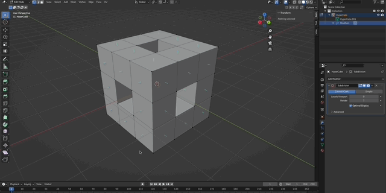
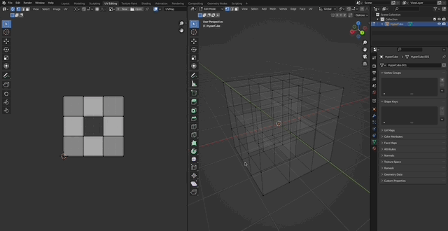
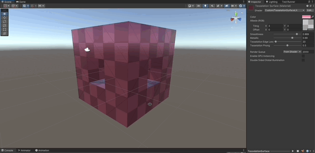

# Tessellation in a Surface Shader for the Built-In RP

Written in the Cg programming language in Unity **Unity 2021.3.10f1**

## References

- [Learn Unity Shaders from Scratch by Nik Lever](https://www.udemy.com/course/learn-unity-shaders-from-scratch)

## Tesselation Support in Metal

1. Metal does tessellation [in a completely different way than all other APIs](https://forum.unity.com/threads/tessellation-shader-on-metal-without-surface-shader.1116316/).Metal doesn't support Hull, Domain, or Geometry shader stages, only vertex and fragment shader stages. Instead Metal uses a compute shader to calculate the tessellation for the mesh, and then the mesh is rendered as if it's using a normal vertex fragment shader.
1. OpenGL Core [does have support for tessellation](https://docs.unity3d.com/Manual/SL-SurfaceShaderTessellation.html) and can be [enabled for the editor](https://docs.unity3d.com/Manual/OpenGLCoreDetails.html).
1. OpenGL Core can also be forced via [command line arguments](https://docs.unity3d.com/Manual/EditorCommandLineArguments.html).
1. Sadly OpenGL is [no longer supported](https://issuetracker.unity3d.com/issues/m1-switching-to-openglcore-doesnt-actually-change-the-active-graphics-api) on Apple Silicon chips.
1. If you are running on an apple silicon chip, tessellation won't work for you with the surface shader in this project.

## Implementation explained

### Setup the Mesh

1.  Create a low poly mesh in blender.
1.  Ensure the UV map is setup correctly.




### Surface Shader

1. Create a Surface Shader with standard lighting model.
1. The Standard Surface Shader will take care of lighting, shadows, tiling and offset.

```c
CGPROGRAM
#pragma surface surf Standard nolightmap

sampler2D _MainTex;

struct Input
{
   float2 uv_MainTex;
};

half _Glossiness;
half _Metallic;
fixed4 _Color;
float _TessellationEdgeLength;
float _TessellationPhong;

void surf (Input IN, inout SurfaceOutputStandard o)
{
   // Albedo comes from a texture tinted by color
   fixed4 c = tex2D (_MainTex, IN.uv_MainTex) * _Color;
   o.Albedo = c.rgb;
   // Metallic and smoothness come from slider variables
   o.Metallic = _Metallic;
   o.Smoothness = _Glossiness;
   o.Alpha = c.a;
}
ENDCG
```



### Tessellation

1. Add the `#pragma` directives and define a custom function for tessellation.

```c
#pragma surface surf Standard nolightmap tessellate: tessellateEdge tessphong: _TessellationPhong

#include "Tessellation.cginc"

float _TessellationEdgeLength;
float _TessellationPhong;

float4 tessellateEdge(
   appdata_full vertex0,
   appdata_full vertex1,
   appdata_full vertex2
)
{
   // can create custom tessellation code here,
   // or use Unity's built in functions
   return UnityEdgeLengthBasedTess(
         vertex0.vertex,
         vertex1.vertex,
         vertex2.vertex,
         _TessellationEdgeLength
   );
}
```
